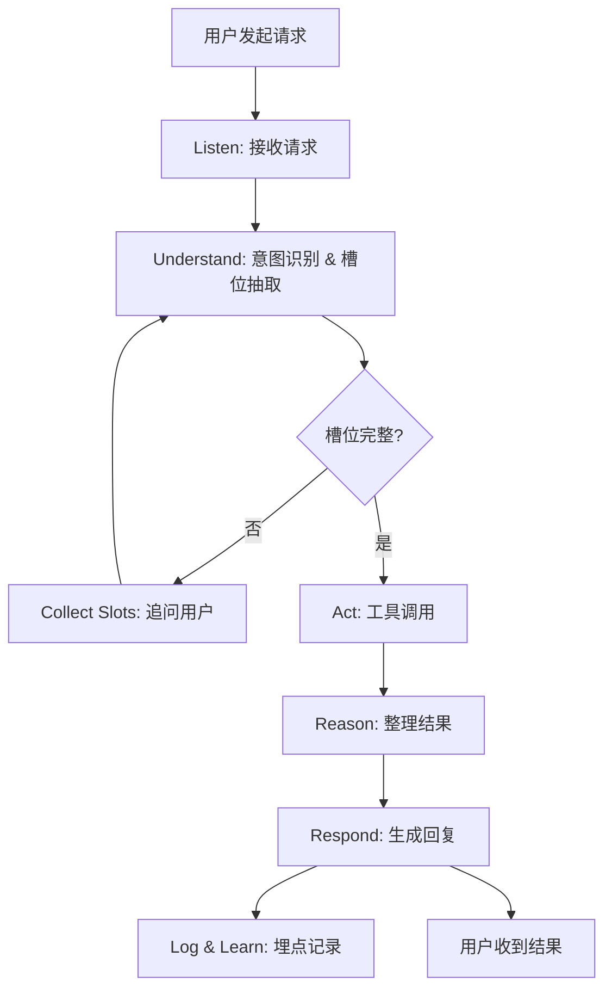
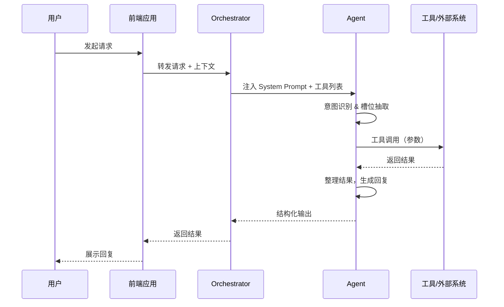

# AI 产品 PRD 模板

按下面结构起草。这份模板适合**产品本身包含 AI/Agent 能力**的项目启动场景（如智能客服、AI 助手、内容生成工具、对话式应用等），对应 [ai-product-output-standard.md](ai-product-output-standard.md) 的必要交付部分。

如果产品本身不包含 AI 能力，应使用 [prd-template-general.md](prd-template-general.md) 替代。

不必机械照抄所有章节，但不要删掉"非目标""假设""开放问题"，以及 AI 产品特有的"Agent 故事""Prompt 设计规范""评测集""评估体系"。

---

## 标题

一句话写清楚这个产品是什么，以及它要解决什么问题。

---

## 1. 需求背景与目标

- 当前问题是什么
- 为什么值得做
- 目标用户是谁
- 希望达到什么业务结果
- 成功标准如何量化（每条指标都要能测量）

推荐结构：

- **背景问题：** …
- **目标用户：** …
- **核心场景：** …
- **业务目标：** …
- **量化指标：** …

---

## 2. 现有流程与用户故事

- 用户当前如何完成这项任务
- 当前流程的关键痛点是什么
- 哪些步骤未来会被 AI 替代、增强或重排

用户故事格式（用于描述人的目标和场景）：

- 作为 `<用户角色>`，在 `<使用场景>` 下，为了 `<目标>`，我需要 `<能力或支持>`

---

## 3. Agent 故事

> 不描述"用户想做什么"，而是描述"Agent 为完成任务，需要哪些上下文、工具和能力支持"。

每个 Agent 角色至少写清楚：

- **Agent 名称与角色定位：** …
- **任务目标：** …
- **所需上下文：** …（历史记录、用户信息、业务规则等）
- **所需工具：** …（工具名、用途、调用时机）
- **所需能力：** …（识别/生成/检索/决策）
- **输出要求：** …（格式、字段、约束）
- **关键边界：** …（不能做什么、失败时怎么处理）

Agent 故事格式：

- 作为 `<Agent 角色>`，在 `<任务场景>` 下，为了 `<完成某个目标>`，需要 `<上下文/工具/能力支持>`

---

## 4. 用户旅程与 Agent 工作流

**用户旅程（人的视角）：**

- 用户如何发起任务
- 各步骤中用户看到什么、需要做什么
- 哪些节点需要用户确认、授权或决策

**Agent 工作流（Agent 的视角）：**

至少覆盖下面阶段：

| 阶段 | 说明 | 用户可见？ |
|------|------|-----------|
| Listen | 接收请求 | 是 |
| Understand | 识别意图、抽取槽位 | 否 |
| Collect Slots | 补齐缺失信息 | 是（追问） |
| Act | 选择工具并执行 | 否 |
| Reason | 整理结果并形成判断 | 否 |
| Respond | 生成用户可读回复 | 是 |
| Log & Learn | 记录日志、埋点、Badcase | 否 |

**工作流图（Mermaid）：**



根据实际产品调整节点，删除不适用的阶段，补充产品特有步骤。

---

## 5. 界面草图与交互说明

> AI 产品的界面从纯 GUI 转向 LUI（对话为主、GUI 组件为辅）。

回答以下问题：

- 用户通过什么方式发起任务（自然语言 / 表单 / 指令）
- 哪些环节只需要对话完成
- 哪些环节需要插入 GUI 组件（表单、按钮、卡片、图表）
- GUI 插入后，上下文连续性如何保持
- Agent 的回复通过何种方式展示

如有设计稿，附链接；如没有，用文字或 ASCII 草图说明关键交互节点。

---

## 6. 功能设计与功能清单

每个功能点至少写清楚：

| 功能名称 | 目标 | 实现要点 | 关键技术 | 输入 | 输出 |
|----------|------|----------|----------|------|------|
| … | … | … | … | … | … |

如果功能直接依赖大模型，必须明确：

- 是识别类 / 生成类 / 检索类 / 决策类哪种能力
- 是否依赖知识库、向量库、外部系统或工具调用
- 是否需要多轮对话补齐信息

---

## 7. Prompt 设计规范

> 传统"功能细节"在 AI 产品中部分转化为 Prompt Specification，这不是附属说明，而是核心需求文档的一部分。

### 7.1 角色定位

- Agent 是谁
- 负责什么任务
- 对业务理解的范围边界

### 7.2 核心挑战

列出模型最容易出错的关键点，例如：

- 用户表达不规范
- 缺少关键槽位
- 工具参数不完整
- 多候选结果冲突
- 不能编造数据

### 7.3 设计策略

写清如何降低风险：

- 强化角色与约束
- 结构化指令列表
- Few-shot 示例
- 工具绑定策略
- 异常情况处理
- JSON Schema 输出约束

### 7.4 关键输出控制

- 输出字段定义
- 字段解释与校验规则
- 错误处理逻辑与重试机制
- 明确禁止编造内容的条件

### 7.5 完整提示词

交付物必须可复制、可执行、可校验：

```
[System Prompt]
…

[工具调用规则]
…

[输出格式要求]
…

[Few-shot 示例]
…
```

---

## 8. 数据评测集设计

| 数据类型 | 描述与用途 | 规模要求 | 标注方式 | 覆盖范围 | 注意事项 |
|----------|-----------|----------|----------|----------|----------|
| 用户需求描述 | … | … | … | … | … |
| NER/槽位标注 | … | … | … | … | … |
| 高质量匹配对 | … | … | … | … | … |
| 失败样本/Badcase | … | … | … | … | … |

---

## 9. 评估体系

每个核心功能至少写清楚：

| 功能 | 测试方法 | 核心指标 | 达标阈值 | 上线门槛 |
|------|----------|----------|----------|----------|
| … | … | … | … | … |

指标参考：

- 识别准确率：Precision / Recall / F1
- 任务完成指标：完成率、平均轮次、超时率
- 生成质量：完整性、专业度、人工评分
- 排序与匹配：NDCG、MRR、Top-K 命中率
- 线上效果：转化率、解决率、人工转接率、用户满意度

---

## 10. 非功能性需求

至少覆盖：

- **性能：** P95 响应时间、队列容量、并发上限
- **安全：** 权限边界、敏感信息脱敏、数据隔离
- **埋点：** 关键节点日志、Badcase 上报、用户反馈收集
- **监控：** 成功率告警、耗时分布、模型失败分类
- **灰度：** 上线策略、A/B 方案
- **人工兜底：** 模型失败时的降级路径、高风险任务的人类确认机制
- **成本控制：** 单次调用成本估算、预算上限
- **合规：** 内容安全、隐私政策、监管要求

---

## Agent 专属交付物（适用于 Agent 中心型产品）

> 当产品以 Agent 为核心设计时，补充下面 4 项。

### A. Agent 职责说明

- **Agent 名称：** …
- **角色定位：** …
- **核心能力：** …
- **核心职责：** …
- **典型异常处理：** …

### B. Inputs 定义

- 用户自然语言 Query
- 用户标识信息
- 上下文信息（历史轮次、会话状态）
- Agent 配置参数
- 业务规则与约束

### C. Outputs 定义

结构化输出（给系统校验、埋点、回放）：

| 字段 | 含义 | 示例值 |
|------|------|--------|
| … | … | … |

自然语言输出（给用户直接阅读）：

- 格式要求、语气要求、长度约束

### D. Agent 数据流时序图（Mermaid）



根据实际产品调整参与者和步骤。

---

## 非目标

列出这次明确不做的内容，避免范围蔓延。

## 约束与依赖

- 团队、预算、时间约束
- 外部依赖（第三方 API、数据源、审批链路）
- 关键技术约束（模型能力边界、已知限制）

## 风险

- 哪些问题最可能导致失败或延期
- 哪些需求最容易被低估
- 哪些地方需要额外验证

## 假设

列出为了完成文档而做出的合理假设，每条说明假设理由。

## 开放问题

列出仍需确认的问题，每条写清楚它会影响什么决策。

## 后续阶段建议

说明 MVP 之后可能如何演进，但不要把后续阶段需求混入当前范围。
